<h1 align="center">Hi there 👋, I'm Zhengkun.</h1>

  Computer science · machine learning · software engineering

  <a href="https://zklou.github.io/Portfolio/">Portfolio</a> ·
  <a href="https://www.linkedin.com/in/zhengkun-lou/">LinkedIn</a> ·
  <a href="mailto:ZhengkunLou@gmail.com">Email</a>

  

Contribution count follows GitHub's profile calendar. Trophies reflect public activity. Images refresh daily when their sources are available.

### Education

- **Georgia Institute of Technology** — M.S. in Computer Science, 2025–2026
- **York University** — B.Sc. in Computer Science, Specialized Honours, 2019–2023
